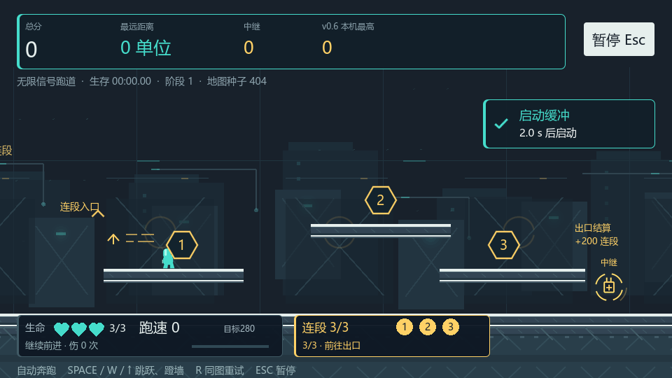

# 信号跑道 · Signal Runway

一个 2D 平台跳跃跑酷游戏。无限挑战自动奔跑，跳跃选择路线并接入中继，争取安全距离；后方滚动的信号崩塌持续追赶。提供无限计分、固定追赶、计时挑战和控制测试房。

当前工程 **v0.6**：地图编排缓和、挑战、分路与恢复段，高路按顺序接入三个节点并通过出口获得连段奖励，恢复站用路线选择补一点生命或额外积分。继承立体地形、三点生命、距离加速与崩塌追赶。编辑器增加节奏/奖励调参和选段定点试玩。打开 `scenes/tools/generation_editor.tscn` 按 F6；F5 运行无限挑战，固定关与计时挑战保留。

## 运行

1. 使用 Godot **4.7.2 stable** 导入根目录的 `project.godot`。
2. 按 **F5** 运行，进入开始界面。
3. 按 Enter 或点击无限挑战，角色自动奔跑；也可选择固定关进入追赶或计时模式。

本仓库交付源工程，没有打包的可执行文件。主场景是 `scenes/main/main.tscn`。本机验证使用 Windows、Forward+、D3D12 和 NVIDIA RTX 4050 Laptop GPU；其他设备与平台尚未验证。

| 操作 | 按键 |
| --- | --- |
| 移动 | 无限自动向右；固定关 A/D 或左右箭头 |
| 跳跃、蹬墙 | Space、W 或上箭头；短按低跳，长按高跳 |
| 重新挑战 | R；无限保留同一地图种子 |
| 暂停、继续 | Esc |
| 开始、结算后再玩 | Enter 或界面按钮 |
| 控制测试房 | F2 或开始界面的按钮 |

无限挑战开局三点生命，缓冲2秒后推进信号崩塌。尖刺和掉坑扣一点并降速，掉坑尝试回最近安全落脚点；生命归零或吞没结束本轮。无伤新增距离提升目标跑速280至380，受伤后重新积累。分数按最远距离、唯一中继、完成连段和恢复站积分计算，同一中继片段首次接入延迟0.9秒，额外奖励不增加延迟。R/Enter同图重试，换图使用新种子。v0.6最高分保存在signal_runway_endless_v06.json，旧纪录保留。固定关保留原规则，Esc冻结逻辑及动态场景。

## v0.6 内容

- 四类段落按种子与距离阶段编排，挑战最多连续两段，恢复站每16至24片段出现，前后使用缓和连接。
- 高路三个有序挑战节点，出口完成额外200分；伤害、漏点或落回下路中断，基础节点分保留。
- 恢复站补1生命上限3，或积分200，只能选择一次，满血明确提示，终局不能靠补血复活。
- 编辑器显示段落、路线与实际奖励，支持节奏参数和隔离定点起跑；旧v2/v3保持原行为，显式升级v4。
- 测试方法与验收范围见本版报告，自动输入和加速游戏时间不代表真人体验。

## v0.5 内容与验证

- 阶梯、下沉、桥接、平台链、上下分路和高处接入六结构，按高差32/48/64、间距64/80/96生成实际几何。
- 3生命、1.2秒受伤无敌、伤害降速、掉坑安全恢复；下沉镜头跟随，上层平台允许从下方通过。
- 编辑器显示实际几何/路线/选段原因，支持几何调参、旧v2配置适配、命名方案/确认应用/备份和隔离试玩。工具F9受伤、F10掉坑、F8返回。
- 324真实物理路线、100种子×200段、14项GPU工具、77旧关回归及主美图形检查通过；完整范围与局限见本版验收报告。

## v0.4 内容与验证

- 12模板、同种子复现、安全接缝、每5–6片段可选中继、分阶段地形和公开追速。
- 活动片段回收、节点与装饰缓存清理、长距离坐标重定位，保持滚动信号波与视差连续。
- 距离/中继计分、失败结果、同图/换图、最高纪录原子保存与损坏降级。
- 100种子×200片段、148连接路线、计分/存档19项、GPU集成20项及旧关77项回归通过；游戏内30分钟加速长局最多7活动段。
- 外部玩家趣味性、主观压力与听感尚未验证。实际测试范围见最终验收报告。

## v0.2 内容与验证

- 四段首关：安全教学、单项练习、组合挑战、终点冲刺。
- 移动与跳跃、墙面动作、尖刺与坠落、重生、开始/暂停/结算、计时与会话最佳成绩。
- 信号崩塌前沿、三档警告、原地余量估算、三类失败界面、单一威胁循环与动作音效。
- 最终追赶速度270单位/秒，复用首关和动作参数。普通输入无传送通关48.62秒，两处分别停顿2秒后仍可完成。
- 原计时模式20项回归通过；追赶集成与暂停竞争检查见版本验收报告。外部玩家趣味性与主观听感尚未验证。

## 文档

- [v0.6 制作计划](planning/v0.6-plan.md)
- [v0.6 运行与编辑器说明](docs/run-v0.6.md)
- [v0.6 场景与状态美术](docs/art/v0.6.md)
- [v0.6 正式交付状态](reports/v0.6/delivery-state.md)
- [v0.6 工程验收](reports/v0.6/final-acceptance.md)
- [v0.6 主美独立检查](reports/v0.6/independent-review.md)
- [v0.6 当前源文件清单](reports/v0.6/version-manifest.json)
- [v0.5 制作计划](planning/v0.5-plan.md)
- [v0.5 运行与工具说明](docs/run-v0.5.md)
- [v0.5 工程验收](reports/v0.5/final-acceptance.md)
- [v0.5 主美独立检查](reports/v0.5/independent-review.md)
- [v0.5 当前源文件清单](reports/v0.5/version-manifest.json)
- [地图生成编辑器运行说明](docs/run-v0.4.1-editor.md)
- [v0.4.1 工具制作计划](planning/v0.4.1-editor-plan.md)
- [v0.4.1 工具源工程验收](reports/v0.4.1/final-acceptance.md)
- [v0.4 内容设计与制作计划](planning/v0.4-execution-plan.md)
- [v0.4 运行与实际规则](docs/run-v0.4.md)
- [v0.4 最终同版本集成](reports/v0.4/integration.md)
- [v0.4 主美独立检查](reports/v0.4/independent-review.md)
- [v0.4 最终工程验收](reports/v0.4/final-acceptance.md)
- [v0.4 当前源文件清单](reports/v0.4/version-manifest.json)
- [v0.3 内容设计与制作计划](planning/v0.3-execution-plan.md)
- [v0.3 运行说明](docs/run-v0.3.md)
- [v0.3 路线与中继收益](reports/v0.3/route-budget.md)
- [v0.3 主美独立检查](reports/v0.3/independent-review.md)
- [v0.3 最终工程验收](reports/v0.3/final-acceptance.md)
- [v0.3 当前源文件清单](reports/v0.3/version-manifest.json)
- [v0.2.1 动态美术优化与运行说明](docs/run-v0.2.1.md)
- [v0.2.1 画面检查与交付](reports/v0.2.1/final-acceptance.md)
- [v0.2.1 当前源文件清单](reports/v0.2.1/version-manifest.json)
- [v0.2 信号崩塌追赶挑战计划](planning/v0.2-execution-plan.md)
- [v0.2 运行与规则说明](docs/run-v0.2.md)
- [总体策划、双人开发计划及工程实现记录](docs/gamecreator/modules/gameplay/planning.md)
- [美术资源与事件接口](docs/art/v0.2-assets.md)
- [集成验证](reports/v0.2/integration.md)
- [主美独立检查](reports/v0.2/independent-review.md)
- [最终验收](reports/v0.2/final-acceptance.md)
- [运行源文件与 SHA256 清单](reports/v0.2/version-manifest.json)
- [v0.1 历史验收记录](reports/v0.1/final-acceptance.md)

## 目录

| 路径 | 内容 |
| --- | --- |
| `scripts/` | 玩家、关卡、流程、界面与表现脚本，逻辑验证脚本 |
| `scenes/` | 主场景、首关、角色、UI 主题与测试房 |
| `assets/` | PNG 视觉资源和 WAV 音效 |
| `docs/`、`planning/` | 项目设计、运行说明与资源规范 |
| `reports/v0.1/` 至 `reports/v0.6/` | 各版本验收报告、结果数据与实际画面 |

仓库保留工程当前依赖的 `addons/godot_ai`，其第三方许可见 [MIT LICENSE](addons/godot_ai/LICENSE)。游玩使用 F5；AI 开发连接需另行按插件文档配置。本机 Godot 缓存、GameCreator 连接信息、私人令牌及操作流水不纳入仓库。
