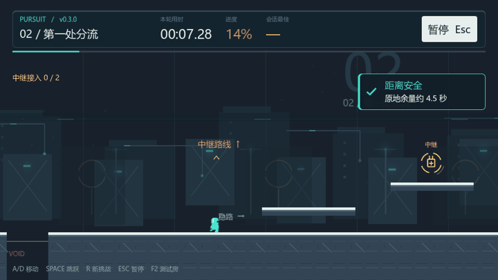

# 信号跑道 · Signal Runway

一个 2D 平台跳跃跑酷游戏。v0.2 加入从后方持续推进的信号崩塌：保持手动跑跳和蹬墙，争取安全距离，停顿会让威胁靠近。提供追赶挑战、原计时挑战和控制测试房。

当前版本 **v0.3**：新增断线中继站、两处分支和两个可选中继。身体接触金色节点可延迟追赶0.9秒；选择稳路或更准确的跑跳路线，为后续动作争取余量。

## 运行

1. 使用 Godot **4.7.2 stable** 导入根目录的 `project.godot`。
2. 按 **F5** 运行，进入开始界面。
3. 选择断线中继站或原首关，按 Enter 或点击追赶挑战；也可进入所选关卡的计时模式。

本仓库交付源工程，没有打包的可执行文件。主场景是 `scenes/main/main.tscn`。本机验证使用 Windows、Forward+、D3D12 和 NVIDIA RTX 4050 Laptop GPU；其他设备与平台尚未验证。

| 操作 | 按键 |
| --- | --- |
| 移动 | A/D 或左右箭头 |
| 跳跃、蹬墙 | Space、W 或上箭头；短按低跳，长按高跳 |
| 重新挑战 | R |
| 暂停、继续 | Esc |
| 开始、结算后再玩 | Enter 或界面按钮 |
| 控制测试房 | F2 或开始界面的按钮 |

追赶挑战在首次动作后缓冲2秒，再启动后方崩塌。尖刺、坠落或吞没会结束本轮，R 或 Enter 立即重开。原计时模式保留死亡自动回起点、继续累计时间与死亡数的规则。暂停冻结挑战，两种模式分别保存会话最佳，失败不更新最佳。

## v0.2 内容与验证

- 四段首关：安全教学、单项练习、组合挑战、终点冲刺。
- 移动与跳跃、墙面动作、尖刺与坠落、重生、开始/暂停/结算、计时与会话最佳成绩。
- 信号崩塌前沿、三档警告、原地余量估算、三类失败界面、单一威胁循环与动作音效。
- 最终追赶速度270单位/秒，复用首关和动作参数。普通输入无传送通关48.62秒，两处分别停顿2秒后仍可完成。
- 原计时模式20项回归通过；追赶集成与暂停竞争检查见版本验收报告。外部玩家趣味性与主观听感尚未验证。

## 文档

- [v0.3 内容设计与制作计划](planning/v0.3-execution-plan.md)
- [v0.3 运行说明](docs/run-v0.3.md)
- [v0.3 路线与中继收益](reports/v0.3/route-budget.md)
- [v0.3 主美独立检查](reports/v0.3/independent-review.md)
- [v0.3 最终工程验收](reports/v0.3/final-acceptance.md)
- [v0.3 当前源文件清单](reports/v0.3/version-manifest.json)
- [v0.2.1 动态美术优化与运行说明](docs/run-v0.2.1.md)
- [v0.2.1 画面检查与交付](reports/v0.2.1/final-acceptance.md)
- [v0.2.1 当前源文件清单](reports/v0.2.1/version-manifest.json)
- [v0.2 信号崩塌追赶挑战计划](planning/v0.2-execution-plan.md)
- [v0.2 运行与规则说明](docs/run-v0.2.md)
- [总体策划、双人开发计划及工程实现记录](docs/gamecreator/modules/gameplay/planning.md)
- [美术资源与事件接口](docs/art/v0.2-assets.md)
- [集成验证](reports/v0.2/integration.md)
- [主美独立检查](reports/v0.2/independent-review.md)
- [最终验收](reports/v0.2/final-acceptance.md)
- [运行源文件与 SHA256 清单](reports/v0.2/version-manifest.json)
- [v0.1 历史验收记录](reports/v0.1/final-acceptance.md)

## 目录

| 路径 | 内容 |
| --- | --- |
| `scripts/` | 玩家、关卡、流程、界面与表现脚本，逻辑验证脚本 |
| `scenes/` | 主场景、首关、角色、UI 主题与测试房 |
| `assets/` | PNG 视觉资源和 WAV 音效 |
| `docs/`、`planning/` | 项目设计、运行说明与资源规范 |
| `reports/v0.1/` 至 `reports/v0.3/` | 各版本验收报告、结果数据与实际画面 |

仓库保留工程当前依赖的 `addons/godot_ai`，其第三方许可见 [MIT LICENSE](addons/godot_ai/LICENSE)。游玩使用 F5；AI 开发连接需另行按插件文档配置。本机 Godot 缓存、GameCreator 连接信息、私人令牌及操作流水不纳入仓库。
