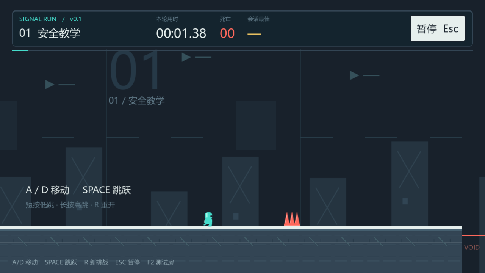

# 信号跑道 · Signal Runway

一个 2D 平台跳跃跑酷游戏。v0.1 提供一条四段关卡，包含可变高度跳跃、离地补跳、跳跃缓冲、墙滑和蹬墙，以及快速重试和通关计时。

## 运行

1. 使用 Godot **4.7.2 stable** 导入根目录的 `project.godot`。
2. 按 **F5** 运行，进入开始界面。
3. 按 Enter 或点击开始按钮进入首关。

本仓库交付源工程，没有打包的可执行文件。主场景是 `scenes/main/main.tscn`。本机验证使用 Windows、Forward+、D3D12 和 NVIDIA RTX 4050 Laptop GPU；其他设备与平台尚未验证。

| 操作 | 按键 |
| --- | --- |
| 移动 | A/D 或左右箭头 |
| 跳跃、蹬墙 | Space、W 或上箭头；短按低跳，长按高跳 |
| 重新挑战 | R |
| 暂停、继续 | Esc |
| 开始、结算后再玩 | Enter 或界面按钮 |
| 控制测试房 | F2 或开始界面的按钮 |

死亡会自动回到起点，保留本轮用时和死亡数。暂停不计时，R 清零本轮统计。最佳成绩只保留在当前运行会话中。

## v0.1 内容与验证

- 四段首关：安全教学、单项练习、组合挑战、终点冲刺。
- 移动与跳跃、墙面动作、尖刺与坠落、重生、开始/暂停/结算、计时与会话最佳成绩。
- 角色与环境视觉、UI 主题、五类动作音效，以及开发用控制测试房。
- 12 项玩家运动检查、20 项流程集成检查通过。自动输入无传送全程通关 48.62 秒，0 死亡、2 次蹬墙。
- 同版本主美独立技术与表现检查通过；外部玩家趣味性研究尚未开展。

## 文档

- [运行与规则说明](docs/run-v0.1.md)
- [总体策划、双人开发计划及工程实现记录](docs/gamecreator/modules/gameplay/planning.md)
- [美术资源与事件接口](docs/art/v0.1-assets.md)
- [集成验证](reports/v0.1/integration.md)
- [主美独立检查](reports/v0.1/independent-review.md)
- [最终验收](reports/v0.1/final-acceptance.md)
- [运行源文件与 SHA256 清单](reports/v0.1/version-manifest.json)

## 目录

| 路径 | 内容 |
| --- | --- |
| `scripts/` | 玩家、关卡、流程、界面与表现脚本，逻辑验证脚本 |
| `scenes/` | 主场景、首关、角色、UI 主题与测试房 |
| `assets/` | PNG 视觉资源和 WAV 音效 |
| `docs/`、`planning/` | 项目设计、运行说明与资源规范 |
| `reports/v0.1/` | 验收报告、结果数据与实际画面 |

仓库保留工程当前依赖的 `addons/godot_ai`，其第三方许可见 [MIT LICENSE](addons/godot_ai/LICENSE)。游玩使用 F5；AI 开发连接需另行按插件文档配置。本机 Godot 缓存、GameCreator 连接信息、私人令牌及操作流水不纳入仓库。
